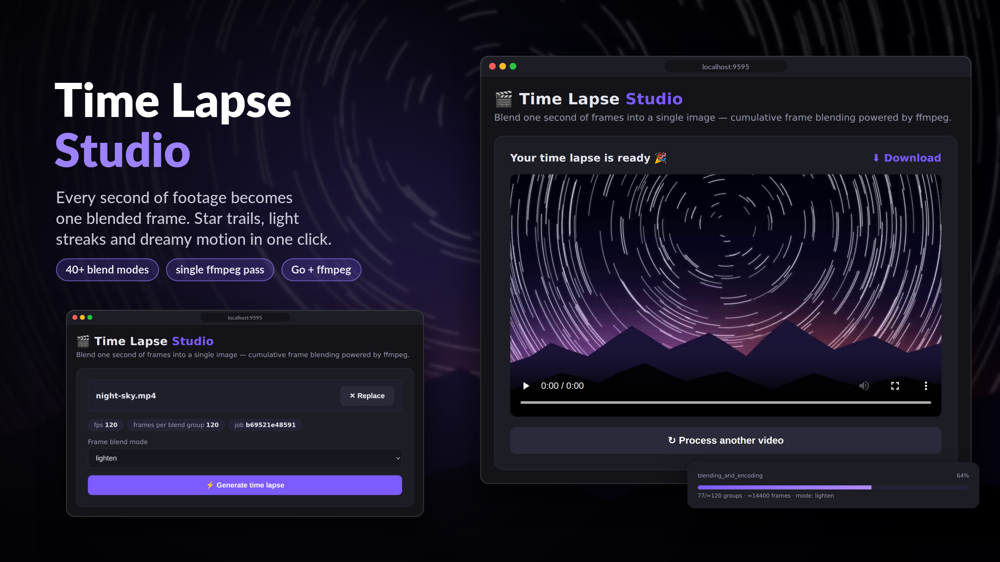

# Time Lapse Studio

A web-based application that transforms videos into motion-blur time lapses using cumulative frame blending. Upload any video, select a blend mode, and generate a stylized time-lapse output in your browser.

  

## Features

- Drag and drop upload with support for MP4, MOV, MKV, AVI, WebM (up to 2 GiB)
- Multiple blend modes: choose from 30+ FFmpeg blend modes (screen, overlay, difference, lighten, etc.)
- Accurate framerate detection: handles variable frame rate (VFR) sources correctly
- Real-time progress tracking: monitor processing stages and completion percentage
- Inline playback: preview and download your time-lapse immediately after generation
- Automatic cleanup: jobs are purged after 2 hours to save disk space

## How It Works

The app performs three phases of video processing:

1. Extraction: the source video is split into individual PNG frames at the probed framerate (for example, 30 fps produces 30 frames per second).
2. Blending: frames are grouped by source second and cumulatively blended together. Frame 1 acts as the background; frames 2 through N are overlaid using the selected blend mode.
3. Encoding: the blended frames are reassembled into an H.264 MP4 at the original video framerate.

Result: a 120-second, 30 fps video becomes 120 blended frames, producing a 4-second, 30 fps output (approximately 30x speedup).

## Prerequisites

- Go 1.22 or newer
- FFmpeg: both `ffmpeg` and `ffprobe` binaries must be on your system PATH

### Installing FFmpeg

macOS (Homebrew):

    brew install ffmpeg

Linux (Ubuntu/Debian):

    sudo apt-get update && sudo apt-get install ffmpeg

Windows (Chocolatey):

    choco install ffmpeg

Verify installation:

    ffmpeg -version
    ffprobe -version

## Installation

1. Clone the repository:

       git clone https://github.com/yourusername/timelapse-studio.git
       cd timelapse-studio

2. Initialize Go modules (if not already done):

       go mod init timelapse

3. Download dependencies:

       go mod tidy

## Running Locally

Start the server:

    go run .

The server listens on http://localhost:9595/. Open that URL in your browser to begin uploading videos.

## Architecture

### Project Structure

    timelapse-studio/
    |-- main.go                 HTTP server + FFmpeg pipeline
    |-- go.mod                  Go module definition
    |-- go.sum                  Dependency checksums
    |-- LICENSE                 MIT license
    |-- README.md               This file
    `-- static/
        `-- index.html          Frontend UI (embedded)

### Key Components

| Component | Description |
|-----------|-------------|
| HTTP Server | Standard library net/http with custom routes for upload/status/result |
| Job Store | In-memory job registry with mutex-protected concurrent access |
| FFmpeg Pipeline | Three-phase process: extract, blend, encode (runs as subprocess via os/exec) |
| Blend Workers | Up to 6 concurrent FFmpeg invocations for parallel group processing |
| Janitor | Background goroutine that cleans expired jobs every 10 minutes |

### API Endpoints

| Method | Path | Description |
|--------|------|-------------|
| GET | `/` | Serve UI (static HTML) |
| GET | `/api/modes` | List supported blend modes (JSON) |
| POST | `/api/upload` | Upload video file (multipart/form-data) |
| POST | `/api/generate/{id}` | Start processing with selected blend mode |
| GET | `/api/job/{id}` | Poll job status and progress |
| GET | `/api/result/{id}?download=1` | Stream result video or download as attachment |

### Blend Modes Supported

Common options include:

- `screen`, `overlay`, `softlight`, `hardlight` — creative lighting effects
- `addition`, `difference`, `exclude` — motion trail emphasis
- `multiply`, `darken`, `lighten` — exposure adjustments
- `grainmerge`, `grainextract` — texture overlays

The full list depends on your installed FFmpeg version and is shown in the UI after launch.

## Security Considerations

- Upload limit is set to 2 GiB per file (`maxUploadBytes` in code)
- Each job runs in its own temporary directory under `jobs/`
- Job IDs are validated as 12-character hex strings, preventing path traversal
- All processing is local; no data leaves your machine

## Known Limitations

| Issue | Workaround |
|-------|------------|
| Very long videos (30+ minutes) may exhaust disk during frame extraction | Add windowed extraction (`-ss`/`-t` per group), planned for v2 |
| Sub-1-second outputs for clips shorter than one blend group | Enforce minimum frame repetition, planned for v2 |
| No estimated time remaining (processing time varies by video complexity) | Linear progress is shown instead |
| No audio passthrough | Audio is stripped intentionally (`-an` flag) |

## Contributing

Pull requests are welcome. For major changes, please open an issue first to discuss what you would like to change.

1. Fork the repository
2. Create your feature branch (`git checkout -b feature/amazing-feature`)
3. Commit your changes (`git commit -m 'Add amazing feature'`)
4. Push to the branch (`git push origin feature/amazing-feature`)
5. Open a Pull Request

## FAQ

**Q: Why is my output much shorter than my source video?**

A: This is expected. The app compresses time by blending N frames into one image. A 30 fps source produces an output roughly 30 times faster than the original duration.

**Q: Can I change the output framerate?**

A: Currently it matches the source framerate exactly. To change it, modify the `-framerate` flag in the encoding phase of `main.go`.

**Q: My FFmpeg blend-mode detection failed. What now?**

A: The app falls back to a curated list of common modes. You can still use them, but detection helps prevent selecting an unsupported mode.

**Q: Where do the processed files go?**

A: Jobs are stored in the `jobs/` directory relative to where you run the server. They are automatically cleaned up after 2 hours.

## License

MIT License. See the [LICENSE](LICENSE) file for details.
